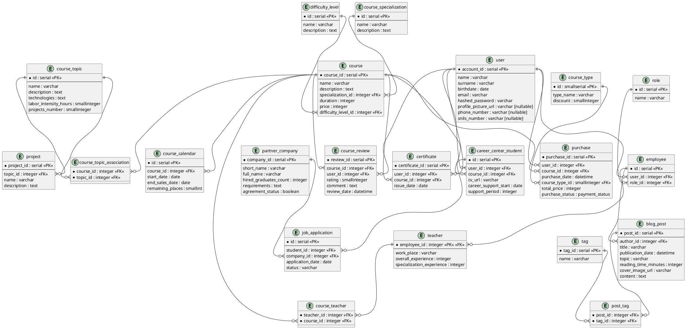

# ERD

Can be rendered using PlantUML.

```plantuml
@startuml

' Courses
entity course {
    *course_id : serial <<PK>>
    --
    name : varchar
    description : text
    specialization_id : integer <<FK>>
    duration : integer
    price : integer
    difficulty_level_id : integer <<FK>>
}

entity difficulty_level {
    *id : serial <<PK>>
    --
    name : varchar
    description : text
}

entity course_specialization {
    *id : serial <<PK>>
    --
    name : varchar
    description : text
}

entity course_topic {
    *id : serial <<PK>>
    --
    name : varchar
    description : text
    technologies : text
    labor_intensity_hours : smallinteger
    projects_number : smallinteger
}

entity course_topic_association {
    *course_id : integer <<FK>>
    *topic_id : integer <<FK>>
}

entity project {
    *project_id : serial <<PK>>
    --
    topic_id : integer <<FK>>
    name : varchar
    description : text
}

' Users
entity user {
    *account_id : serial <<PK>>
    --
    name : varchar
    surname : varchar
    birthdate : date
    email : varchar
    hashed_password : varchar
    profile_picture_url : varchar [nullable]
    phone_number : varchar [nullable]
    snils_number : varchar [nullable]
}

' Employees
entity role {
    *id : serial <<PK>>
    --
    name : varchar
}

entity employee {
    *id : serial <<PK>>
    --
    user_id : integer <<FK>>
    role_id : integer <<FK>>
}

' Schedule
entity course_calendar {
    *id : serial <<PK>>
    --
    course_id : integer <<FK>>
    start_date : date
    end_sales_date : date
    remaining_places : smallint
}

' Teachers
entity teacher {
    *employee_id : integer <<PK>> <<FK>>
    --
    work_place : varchar
    overall_experience : integer
    specialization_experience : integer
}

entity course_teacher {
    *teacher_id : integer <<FK>>
    *course_id : integer <<FK>>
}

' Course Purchasing
entity purchase {
    *purchase_id : serial <<PK>>
    --
    user_id : integer <<FK>>
    course_id : integer <<FK>>
    purchase_date : datetime
    course_type_id : smallinteger <<FK>>
    total_price : integer
    purchase_status : payment_status
}

entity course_type {
    *id : smallserial <<PK>>
    --
    type_name : varchar
    discount : smallinteger
}

' Career Centre
entity career_center_student {
    *id : serial <<PK>>
    --
    user_id : integer <<FK>>
    course_id : integer <<FK>>
    cv_url : varchar
    career_support_start : date
    support_period : integer
}

entity partner_company {
    *company_id : serial <<PK>>
    --
    short_name : varchar
    full_name : varchar
    hired_graduates_count : integer
    requirements : text
    agreement_status : boolean
}

entity job_application {
    *id : serial <<PK>>
    --
    student_id : integer <<FK>>
    company_id : integer <<FK>>
    application_date : date
    status : varchar
}

' Blog
entity blog_post {
    *post_id : serial <<PK>>
    --
    author_id : integer <<FK>>
    title : varchar
    publication_date : datetime
    topic : varchar
    reading_time_minutes : integer
    cover_image_url : varchar
    content : text
}

entity tag {
    *tag_id : serial <<PK>>
    --
    name : varchar
}

entity post_tag {
    *post_id : integer <<FK>>
    *tag_id : integer <<FK>>
}

' Reviews
entity course_review {
    *review_id : serial <<PK>>
    --
    course_id : integer <<FK>>
    user_id : integer <<FK>>
    rating : smallinteger
    comment : text
    review_date : datetime
}

' Certificates
entity certificate {
    *certificate_id : serial <<PK>>
    --
    user_id : integer <<FK>>
    course_id : integer <<FK>>
    issue_date : date
}

' Relations
course_specialization::id ||--o{ course::specialization_id
difficulty_level::id ||--o{ course::difficulty_level_id
course::course_id ||--o{ course_topic_association::course_id
course_topic::id ||--o{ course_topic_association::topic_id
course_topic::id ||--o{ project::topic_id
user::account_id ||--o{ employee::user_id
role::id ||--o{ employee::role_id
course::course_id ||--o{ course_calendar::course_id
employee::id ||--o{ teacher::employee_id
teacher::employee_id ||--o{ course_teacher::teacher_id
course::course_id ||--o{ course_teacher::course_id
course_type::id ||--o{ purchase::course_type_id
user::account_id ||--o{ purchase::user_id
course::course_id ||--o{ purchase::course_id
user::account_id ||--o{ career_center_student::user_id
course::course_id ||--o{ career_center_student::course_id
career_center_student::id ||--o{ job_application::student_id
partner_company::company_id ||--o{ job_application::company_id
employee::id ||--o{ blog_post::author_id
blog_post::post_id ||--o{ post_tag::post_id
tag::tag_id ||--o{ post_tag::tag_id
course::course_id ||--o{ course_review::course_id
user::account_id ||--o{ course_review::user_id
user::account_id ||--o{ certificate::user_id
course::course_id ||--o{ certificate::course_id

@enduml
```
